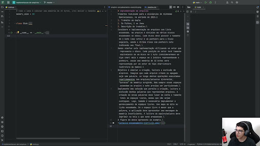

# Implementação de Arquivos
Trabalho realizado para a disciplina de Sistemas Operacionais, no período de 2023.1

## Vídeo
Clique no vídeo para ser redirecionado:\

\
ou [clique aqui](https://drive.google.com/file/d/1A8xICKovWQ1OCNhFTZg1A8UZJfFYADCS/view?usp=sharing).

1. Trabalho em dupla
2. Em Python, C ou Java
3. Descrição do trabalho:\
Considere a implementação de arquivos com lista encadeada. Um arquivo é dividido em vários blocos encadeados no disco. Cada bloco deve possuir o tamanho de 1 byte (uma letra) e um ponteiro para o bloco seguinte, sendo o último bloco com ponteiro nulo indicando seu final.\
Vamos simular esta implementação utilizando um vetor que representa o disco. Cada posição do vetor terá tamanho equivalente de um bloco de 1 byte (consideraremos um tipo char) mais o espaço de 1 inteiro representando o ponteiro. Assim uma memória de 32 bytes será representada por um vetor do tipo char+inteiro (estrutura de dados).\
Objetivo é simular a criação, leitura e exclusão de arquivos. Imagine que cada arquivo criado ou apagado seja uma palavra. Ao longo destas operações executadas repetidamente com arquivos/palavras diferentes, “buracos” de memória surgirão. Nem sempre esses espaços acomodam um arquivo e este precisa ser particionado.\
Implemente uma solução que permita a criação, leitura e exclusão destas palavras que representam arquivos. A criação de novas palavras deve levar em conta o tamanho total de espaços livres, mesmo que não sejam contíguos. Logo, também é necessário implementar o gerenciamento de espaços livres. Use mapa de bits ou lista encadeada. Se o espaço livre é menor que a palavra, a aplicação deve apresentar uma mensagem de memória insuficiente. A leitura do aquivo/palavra deve imprimir na tela o que está armazenado.\
A figura em anexo apresenta um exemplo.\

